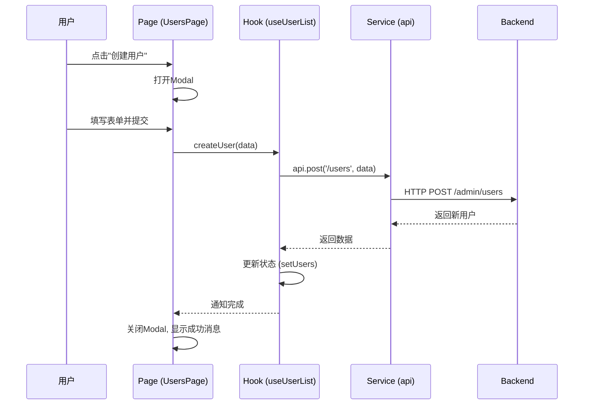

# Admin Frontend - 架构详解

> 三层架构设计原理和最佳实践

## 📋 目录

- [核心理念](#核心理念)
- [架构模式](#架构模式)
- [设计原则](#设计原则)
- [数据流转](#数据流转)
- [状态管理](#状态管理)
- [性能优化](#性能优化)

---

## 核心理念

### 🎯 业界标准三层架构

本项目采用**三层架构**，这是75%后台管理系统采用的标准模式：

```
┌─────────────────────────────────────────────────┐
│  pages/ (页面层 - 编排层)                        │
│  ├─ UsersPage.tsx        ← 编排CRUD功能          │
│  └─ RolesPage.tsx        ← 组合多个组件          │
└─────────────────────────────────────────────────┘
                    ↓ 使用
┌─────────────────────────────────────────────────┐
│  features/ (功能层 - 组件层)                     │
│  ├─ user/                                        │
│  │  ├─ UserTable.tsx     ← 纯展示（无业务逻辑）  │
│  │  ├─ components/       ← Modal、SearchForm等   │
│  │  └─ hooks/            ← 业务逻辑封装          │
│  └─ role/                                        │
└─────────────────────────────────────────────────┘
                    ↓ 调用
┌─────────────────────────────────────────────────┐
│  services/ (服务层 - API层)                      │
│  ├─ api.ts               ← 通用API客户端         │
│  ├─ roleApi.ts           ← 角色API              │
│  └─ menuApi.ts           ← 菜单API              │
└─────────────────────────────────────────────────┘
```

### 为什么使用三层架构？

| 对比项 | 单文件模式 | 三层架构 |
|--------|-----------|---------| 
| **可维护性** | ⚠️ 差（500+行） | ✅ 优（＜200行/文件） |
| **可复用性** | ❌ 低 | ✅ 高 |
| **团队协作** | ⚠️ 冲突多 | ✅ 并行开发 |
| **代码质量** | ⚠️ 混乱 | ✅ 清晰 |
| **测试难度** | ❌ 难 | ✅ 易 |

---

## 架构模式

### Pages层（编排层）

**职责**：
- 组合Features和Services
- 管理Modal显示状态
- 处理用户交互事件

**禁止**：
- ❌ 直接调用API
- ❌ 包含复杂业务逻辑
- ❌ 直接操作DOM

**示例**：
```typescript
// pages/UsersPage.tsx
export default function UsersPage() {
    // ✅ 使用Hook获取数据和方法
    const { users, loading, total, createUser, updateUser } = useUserList();
    
    // ✅ 管理UI状态
    const [modalVisible, setModalVisible] = useState(false);
    const [currentUser, setCurrentUser] = useState<User | null>(null);

    // ✅ 编排组件
    return (
        <div>
            <UserTable 
                users={users}
                loading={loading}
                onEdit={(user) => {
                    setCurrentUser(user);
                    setModalVisible(true);
                }}
            />
            <UserFormModal 
                visible={modalVisible}
                initialValues={currentUser}
                onSubmit={currentUser ? updateUser : createUser}
            />
        </div>
    );
}
```

### Features层（组件层）

**职责**：
- 纯展示组件（Table, Modal, Form）
- 通过Props接收数据和事件
- 无状态或最小UI状态

**禁止**：
- ❌ 调用API
- ❌ 包含业务逻辑
- ❌ 直接访问全局状态

**示例**：
```typescript
// features/user/UserTable.tsx
interface UserTableProps {
    users: User[];           // ✅ 数据通过props
    loading: boolean;
    onEdit: (user: User) => void;  // ✅ 事件通过props
    onDelete: (id: number) => void;
}

export const UserTable: React.FC<UserTableProps> = ({
    users, loading, onEdit, onDelete
}) => {
    // ✅ 只负责渲染，无API调用，无业务逻辑
    const columns = [...];
    
    return <Table columns={columns} dataSource={users} loading={loading} />;
};
```

### Services层（API层）

**职责**：
- HTTP请求封装
- 请求/响应拦截
- 错误处理

**示例**：
```typescript
// services/api.ts
import axios from 'axios';

const api = axios.create({
    baseURL: import.meta.env.VITE_API_BASE_URL,
});

// 请求拦截器
api.interceptors.request.use((config) => {
    const token = localStorage.getItem('token');
    if (token) {
        config.headers.Authorization = `Bearer ${token}`;
    }
    return config;
});

export default api;
```

---

## 设计原则

### 1. 单一职责原则

每个文件/组件只做一件事：

```
✅ UserTable.tsx - 只负责渲染表格
✅ useUserList.ts - 只负责用户列表业务逻辑
✅ UserFormModal.tsx - 只负责表单Modal

❌ UserManagement.tsx - 包含表格+表单+API调用（违反）
```

### 2. 依赖倒置原则

高层模块不依赖低层模块，都依赖抽象：

```typescript
// ✅ 正确：Table依赖Props接口（抽象）
interface UserTableProps {
    users: User[];
    onEdit: (user: User) => void;
}

// ❌ 错误：Table直接依赖API（具体实现）
export const UserTable = () => {
    useEffect(() => {
        api.get('/users').then(setUsers);  // 违反！
    }, []);
};
```

### 3. 开闭原则

对扩展开放，对修改封闭：

```typescript
// ✅ 通过Props扩展功能
<UserTable 
    onEdit={handleEdit}
    onDelete={handleDelete}
    onExport={handleExport}  // 新增功能无需修改Table内部
/>
```

---

## 数据流转

### CRUD操作流程



### 状态更新流程

```
用户操作
  ↓
Page触发事件
  ↓
Hook处理业务逻辑
  ↓
调用Service API
  ↓
更新Hook内部状态
  ↓
React自动重新渲染
  ↓
Table/Modal显示新数据
```

---

## 状态管理

### 状态划分层级

```
全局状态（Context）
├─ 认证状态（AuthContext）
│   - currentUser
│   - isAuthenticated
│   - login()
│   - logout()
└─ 主题配置（ThemeContext）
    - theme
    - setTheme()

页面状态（Page组件）
├─ Modal显示状态
│   - modalVisible
│   - setModalVisible
└─ 选中的数据
    - currentUser
    - setCurrentUser

Feature状态（Custom Hook）
├─ 列表数据（useUserList）
│   - users
│   - loading
│   - total
├─ CRUD操作方法
│   - fetchUsers()
│   - createUser()
│   - updateUser()
│   - deleteUser()
└─ 分页状态
    - currentPage
    - pageSize

组件状态（Component）
└─ UI交互状态
    - expanded（展开/折叠）
    - activeTab（当前标签）
```

### 状态提升规则

```
需要共享状态？
├─ 同一Page内多个组件？
│   → 提升到Page组件
│
├─ 跨多个Page？
│   → 提升到Context
│
└─ 仅单个组件使用？
    → 保留在组件内部
```

---

## 性能优化

### 1. 组件 Memo化

```typescript
// 纯展示组件使用React.memo
export const UserTable = React.memo<UserTableProps>(({ 
    users, loading, onEdit, onDelete 
}) => {
    // ...
});
```

### 2. 回调函数稳定化

```typescript
// ✅ 使用useCallback
const handleEdit = useCallback((user: User) => {
    setCurrentUser(user);
    setModalVisible(true);
}, []);

// ❌ 避免内联函数
<UserTable onEdit={(user) => { /* ... */ }} />
```

### 3. 列表渲染优化

```typescript
// ✅ 使用稳定的key
<Table 
    dataSource={users}
    rowKey="id"  // 或 rowKey={(record) => record.id}
/>

// ❌ 避免使用index作为key
{users.map((user, index) => <div key={index}>...</div>)}
```

### 4. 懒加载

```typescript
// 路由懒加载
const UsersPage = lazy(() => import('./pages/UsersPage'));
const RolesPage = lazy(() => import('./pages/RolesPage'));

<Suspense fallback={<Loading />}>
    <Routes>
        <Route path="/users" element={<UsersPage />} />
        <Route path="/roles" element={<RolesPage />} />
    </Routes>
</Suspense>
```

---

## 可测试性

### 单元测试结构

```
features/user/
├── UserTable.tsx
├── UserTable.test.tsx       # 组件测试
├── hooks/
│   ├── useUserList.ts
│   └── useUserList.test.ts  # Hook测试
└── types.ts
```

### 测试示例

```typescript
// UserTable.test.tsx
import { render, screen } from '@testing-library/react';
import { UserTable } from './UserTable';

test('renders user table with data', () => {
    const users = [{ id: 1, username: 'john' }];
    render(<UserTable users={users} loading={false} />);
    
    expect(screen.getByText('john')).toBeInTheDocument();
});

// useUserList.test.ts
import { renderHook } from '@testing-library/react-hooks';
import { useUserList } from './useUserList';

test('fetches users on mount', async () => {
    const { result, waitForNextUpdate } = renderHook(() => useUserList());
    
    await waitForNextUpdate();
    
    expect(result.current.users).toHaveLength(10);
});
```

---

**清晰的架构，高效的开发！** 🏗️
