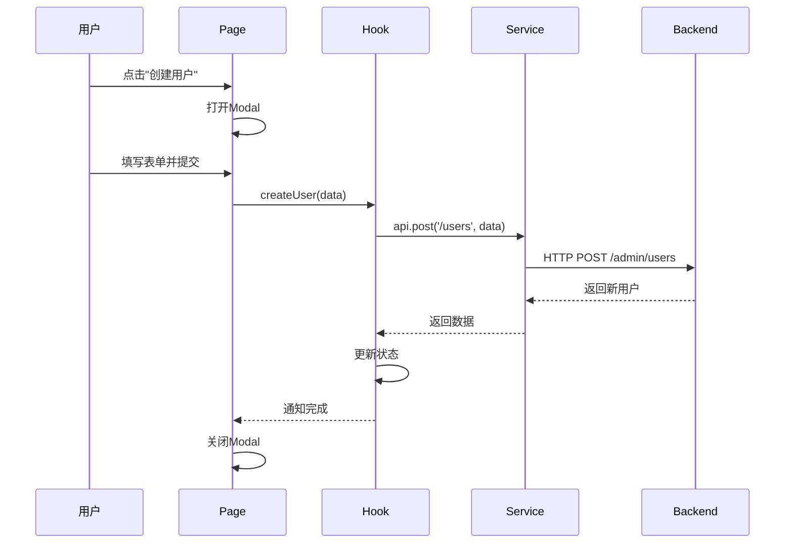

# Admin Frontend - 开发指南

> 完整的架构设计、代码规范和开发工作流

## 📋 目录

- [架构设计](#架构设计)
  - [核心理念](#核心理念)
  - [三层架构详解](#三层架构详解)
  - [设计原则](#设计原则)
  - [数据流转](#数据流转)
  - [状态管理](#状态管理)
  - [性能优化](#性能优化)
- [代码规范](#代码规范)
  - [严格规范](#严格规范)
  - [标准CRUD模式](#标准crud模式)
  - [代码模板](#代码模板)
- [最佳实践](#最佳实践)

---

# 架构设计

## 核心理念

### 🎯 业界标准三层架构

本项目采用**三层架构**，这是75%后台管理系统采用的标准模式：

```
┌─────────────────────────────────────────────────┐
│  pages/ (页面层 - 编排层)                        │
│  ├─ UsersPage.tsx        ← 编排CRUD功能          │
│  └─ RolesPage.tsx        ← 组合多个组件          │
└─────────────────────────────────────────────────┘
                    ↓ 使用
┌─────────────────────────────────────────────────┐
│  features/ (功能层 - 组件层)                     │
│  ├─ user/                                        │
│  │  ├─ UserTable.tsx     ← 纯展示（无业务逻辑）  │
│  │  ├─ components/       ← Modal、SearchForm等   │
│  │  └─ hooks/            ← 业务逻辑封装          │
│  └─ role/                                        │
└─────────────────────────────────────────────────┘
                    ↓ 调用
┌─────────────────────────────────────────────────┐
│  services/ (服务层 - API层)                      │
│  ├─ api.ts               ← 通用API客户端         │
│  ├─ roleApi.ts           ← 角色API              │
│  └─ menuApi.ts           ← 菜单API              │
└─────────────────────────────────────────────────┘
```

### 为什么使用三层架构？

| 对比项 | 单文件模式 | 三层架构 |
|--------|-----------|---------| 
| **可维护性** | ⚠️ 差（500+行） | ✅ 优（＜200行/文件） |
| **可复用性** | ❌ 低 | ✅ 高 |
| **团队协作** | ⚠️ 冲突多 | ✅ 并行开发 |
| **代码质量** | ⚠️ 混乱 | ✅ 清晰 |
| **测试难度** | ❌ 难 | ✅ 易 |

---

## 三层架构详解

### Pages层（编排层）

**职责**：
- 组合Features和Services
- 管理Modal显示状态
- 处理用户交互事件

**禁止**：
- ❌ 直接调用API
- ❌ 包含复杂业务逻辑
- ❌ 直接操作DOM

**示例**：
```typescript
// pages/UsersPage.tsx
export default function UsersPage() {
    const { users, loading, total, createUser, updateUser } = useUserList();
    const [modalVisible, setModalVisible] = useState(false);
    const [currentUser, setCurrentUser] = useState<User | null>(null);

    return (
        <div>
            <UserTable 
                users={users}
                loading={loading}
                onEdit={(user) => {
                    setCurrentUser(user);
                    setModalVisible(true);
                }}
            />
            <UserFormModal 
                visible={modalVisible}
                initialValues={currentUser}
                onSubmit={currentUser ? updateUser : createUser}
            />
        </div>
    );
}
```

### Features层（组件层）

**职责**：
- 纯展示组件（Table, Modal, Form）
- 通过Props接收数据和事件
- 无状态或最小UI状态

**禁止**：
- ❌ 调用API
- ❌ 包含业务逻辑
- ❌ 直接访问全局状态

**示例**：
```typescript
// features/user/UserTable.tsx
interface UserTableProps {
    users: User[];
    loading: boolean;
    onEdit: (user: User) => void;
    onDelete: (id: number) => void;
}

export const UserTable: React.FC<UserTableProps> = ({
    users, loading, onEdit, onDelete
}) => {
    const columns = [...];
    return <Table columns={columns} dataSource={users} loading={loading} />;
};
```

### Services层（API层）

**职责**：
- HTTP请求封装
- 请求/响应拦截
- 错误处理

---

## 设计原则

### 1. 单一职责原则

每个文件/组件只做一件事：
- ✅ UserTable.tsx - 只负责渲染表格
- ✅ useUserList.ts - 只负责用户列表业务逻辑
- ❌ UserManagement.tsx - 包含表格+表单+API调用（违反）

### 2. 依赖倒置原则

高层模块不依赖低层模块，都依赖抽象：
```typescript
// ✅ 正确：Table依赖Props接口
interface UserTableProps {
    users: User[];
    onEdit: (user: User) => void;
}

// ❌ 错误：Table直接依赖API
export const UserTable = () => {
    useEffect(() => {
        api.get('/users').then(setUsers);  // 违反！
    }, []);
};
```

### 3. 开闭原则

对扩展开放，对修改封闭

---

## 数据流转

### CRUD操作流程



---

## 状态管理

### 状态划分层级

```
全局状态（Context）
├─ 认证状态（AuthContext）
└─ 主题配置

页面状态（Page组件）
├─ Modal显示状态
└─ 选中的数据

Feature状态（Custom Hook）
├─ 列表数据
├─ CRUD操作方法
└─ 分页状态

组件状态（Component）
└─ UI交互状态
```

---

## 性能优化

### 1. 组件Memo化
```typescript
export const UserTable = React.memo<UserTableProps>(({ 
    users, loading 
}) => {
    // ...
});
```

### 2. 回调函数稳定化
```typescript
const handleEdit = useCallback((user: User) => {
    setCurrentUser(user);
    setModalVisible(true);
}, []);
```

### 3. 列表渲染优化
```typescript
<Table 
    dataSource={users}
    rowKey="id"
/>
```

### 4. 懒加载
```typescript
const UsersPage = lazy(() => import('./pages/UsersPage'));
```

---

# 代码规范

## 严格规范

### 文件大小限制 ⚠️ 强制

```
✅ 优秀: < 150行
⚠️ 可接受: 150-200行
❌ 需重构: > 200行 (立即拆分)
```

### 标准CRUD模式 ⭐ 所有新功能必须遵循

```
features/xxx/
├── XxxTable.tsx          # 纯展示表格
├── components/
│   └── XxxFormModal.tsx  # 表单Modal
├── hooks/
│   └── useXxxList.ts     # 业务逻辑Hook
├── types.ts              # 类型定义
└── index.ts              # 统一导出
```

**参考标准实现**：
- `features/user/` - 用户模块
- `features/role/` - 角色模块

---

## 代码模板

### 1. Types定义模板

```typescript
// features/product/types.ts
export interface Product {
    id: number;
    name: string;
    price: number;
    createdAt: string;
}

export interface CreateProductRequest {
    name: string;
    price: number;
}

export interface UpdateProductRequest {
    name?: string;
    price?: number;
}
```

### 2. Custom Hook模板

```typescript
// features/product/hooks/useProductList.ts
export const useProductList = () => {
    const [items, setItems] = useState<Product[]>([]);
    const [loading, setLoading] = useState(false);
    const [total, setTotal] = useState(0);

    const createItem = async (data: CreateProductRequest) => {
        try {
            await api.post('/products', data);
            message.success('创建成功');
            await fetchItems();
        } catch (error) {
            message.error('创建失败');
            throw error;
        }
    };

    const fetchItems = async (params?: any) => {
        setLoading(true);
        try {
            const response = await api.get('/products', { params });
            setItems(response.data.content);
            setTotal(response.data.totalElements);
        } catch (error) {
            message.error('加载失败');
        } finally {
            setLoading(false);
        }
    };

    useEffect(() => {
        fetchItems();
    }, []);

    return { items, loading, total, createItem, fetchItems };
};
```

### 3. Table组件模板

```typescript
// features/product/ProductTable.tsx
interface ProductTableProps {
    products: Product[];
    loading: boolean;
    pagination: TablePaginationConfig;
    onEdit: (product: Product) => void;
    onDelete: (id: number) => void;
    onChange: (pagination: any) => void;
}

export const ProductTable: React.FC<ProductTableProps> = ({
    products, loading, pagination, onEdit, onDelete, onChange
}) => {
    const columns: ColumnsType<Product> = [
        { title: 'ID', dataIndex: 'id', width: 70 },
        { title: '名称', dataIndex: 'name' },
        { title: '价格', dataIndex: 'price', render: (price: number) => `¥${price}` },
        {
            title: '操作',
            key: 'actions',
            fixed: 'right',
            width: 150,
            render: (_, record) => (
                <Space>
                    <Button type="link" onClick={() => onEdit(record)}>编辑</Button>
                    <Popconfirm
                        title="确定删除？"
                        onConfirm={() => onDelete(record.id)}
                    >
                        <Button type="link" danger>删除</Button>
                    </Popconfirm>
                </Space>
            ),
        },
    ];

    return (
        <Table
            columns={columns}
            dataSource={products}
            rowKey="id"
            loading={loading}
            pagination={pagination}
            onChange={onChange}
        />
    );
};
```

### 4. FormModal组件模板

```typescript
// features/product/components/ProductFormModal.tsx
interface ProductFormModalProps {
    visible: boolean;
    mode: 'create' | 'edit';
    initialValues?: Product | null;
    onSubmit: (values: any) => Promise<void>;
    onCancel: () => void;
}

export const ProductFormModal: React.FC<ProductFormModalProps> = ({
    visible, mode, initialValues, onSubmit, onCancel
}) => {
    const [form] = Form.useForm();

    useEffect(() => {
        if (visible) {
            if (mode === 'edit' && initialValues) {
                form.setFieldsValue(initialValues);
            } else {
                form.resetFields();
            }
        }
    }, [visible, mode, initialValues, form]);

    const handleSubmit = async () => {
        try {
            const values = await form.validateFields();
            await onSubmit(values);
            form.resetFields();
        } catch (error) {
            console.error('Validation failed:', error);
        }
    };

    return (
        <Modal
            title={mode === 'create' ? '创建' : '编辑'}
            open={visible}
            onOk={handleSubmit}
            onCancel={onCancel}
        >
            <Form form={form} layout="vertical">
                <Form.Item
                    name="name"
                    label="名称"
                    rules={[{ required: true, message: '请输入名称' }]}
                >
                    <Input />
                </Form.Item>
                <Form.Item
                    name="price"
                    label="价格"
                    rules={[{ required: true, message: '请输入价格' }]}
                >
                    <InputNumber style={{ width: '100%' }} min={0.01} precision={2} />
                </Form.Item>
            </Form>
        </Modal>
    );
};
```

### 5. Page编排模板

```typescript
// pages/ProductsPage.tsx
export default function ProductsPage() {
    const { items, loading, total, createItem, updateItem, deleteItem } = useProductList();
    const [modalVisible, setModalVisible] = useState(false);
    const [modalMode, setModalMode] = useState<'create' | 'edit'>('create');
    const [currentProduct, setCurrentProduct] = useState<Product | null>(null);

    const handleCreate = () => {
        setModalMode('create');
        setCurrentProduct(null);
        setModalVisible(true);
    };

    const handleEdit = (product: Product) => {
        setModalMode('edit');
        setCurrentProduct(product);
        setModalVisible(true);
    };

    const handleSubmit = async (values: any) => {
        if (modalMode === 'create') {
            await createItem(values);
        } else if (currentProduct) {
            await updateItem(currentProduct.id, values);
        }
        setModalVisible(false);
    };

    return (
        <div>
            <Button type="primary" onClick={handleCreate}>创建</Button>
            <ProductTable
                products={items}
                loading={loading}
                onEdit={handleEdit}
                onDelete={deleteItem}
            />
            <ProductFormModal
                visible={modalVisible}
                mode={modalMode}
                initialValues={currentProduct}
                onSubmit={handleSubmit}
                onCancel={() => setModalVisible(false)}
            />
        </div>
    );
}
```

---

# 最佳实践

## ✅ 推荐做法

1. **先导航，后开发** - 参考现有user/role模块
2. **引用具体模板** - 使用本文档的标准模板
3. **严格遵守文件大小** - 超过200行立即拆分
4. **组件Props化** - 所有数据和事件通过Props传递

## ❌ 避免做法

1. **组件内调用API** - 必须通过Hook
2. **文件超过200行** - 立即重构
3. **使用any类型** - 定义具体接口
4. **路由直接指向Feature** - 必须通过Page

---

**遵循规范，代码更优雅！** ✨
