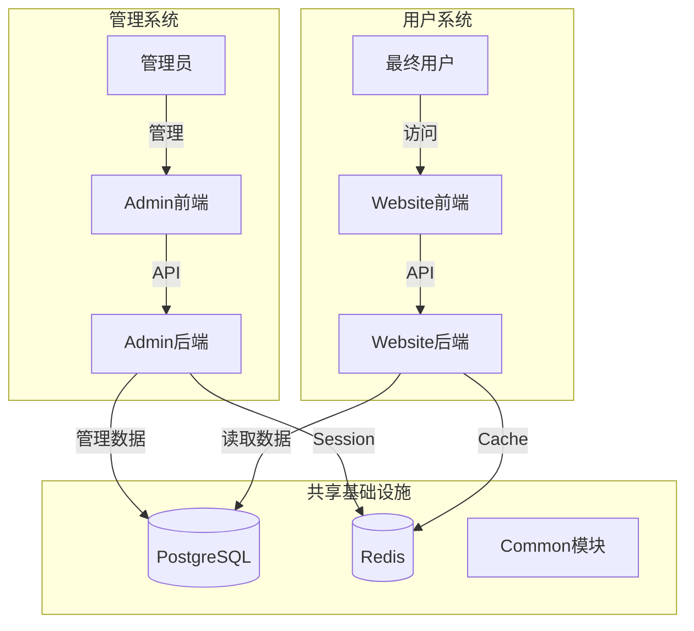
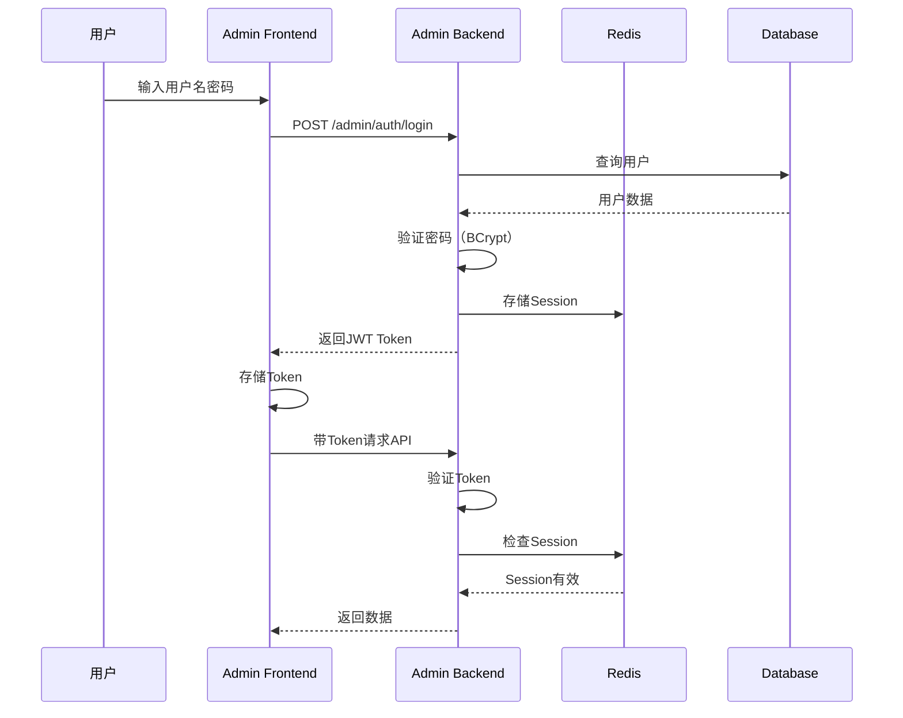

# 项目架构总览

> 萌宠新闻网站 - 全栈项目架构文档

## 📋 目录

- [系统概述](#系统概述)
- [整体架构](#整体架构)
- [模块详解](#模块详解)
- [技术栈选型](#技术栈选型)
- [数据流转](#数据流转)
- [部署架构](#部署架构)

---

## 系统概述

### 项目定位

**萌宠新闻网站** - 包含管理后台和用户前台的完整全栈应用

**核心功能**：
- 🔐 **Admin系统** - 后台管理（用户、角色、新闻管理）
- 📰 **Website系统** - 用户前台（新闻浏览、论坛）
- 🛠️ **Common模块** - 共享工具和基础设施

### 业务架构



---

## 整体架构

### 模块依赖关系

```
webapp/ (根项目)
├── admin/                 # 管理后台模块
│   ├── backend/          # Spring Boot + JPA
│   └── frontend/         # React + Ant Design
│
├── website/              # 用户网站模块
│   ├── backend/          # Spring WebFlux + R2DBC
│   └── frontend/         # Next.js + Tailwind
│
├── common/               # 共享模块
│   └── kotlin/           # 异常、DTO、工具类
│
└── infra/                # 基础设施
    ├── db/migration/     # Flyway SQL
    └── docker/           # Docker配置
```

### 技术架构分层

```
┌─────────────────────────────────────────┐
│         Presentation Layer              │
│  ┌─────────────┐      ┌──────────────┐ │
│  │ Admin UI    │      │ Website UI   │ │
│  │ (React)     │      │ (Next.js)    │ │
│  └─────────────┘      └──────────────┘ │
└─────────────────────────────────────────┘
                   ↓ HTTP/JSON
┌─────────────────────────────────────────┐
│         Application Layer               │
│  ┌─────────────┐      ┌──────────────┐ │
│  │ Admin API   │      │ Website API  │ │
│  │ (REST)      │      │ (Reactive)   │ │
│  └─────────────┘      └──────────────┘ │
└─────────────────────────────────────────┘
                   ↓
┌─────────────────────────────────────────┐
│         Domain Layer                    │
│     Entity + Service + Repository      │
│  ┌─────────────────────────────────┐   │
│  │  Common Module (Shared)         │   │
│  │  Exception, DTO, Utils          │   │
│  └─────────────────────────────────┘   │
└─────────────────────────────────────────┘
                   ↓
┌─────────────────────────────────────────┐
│         Infrastructure Layer            │
│  ┌───────────┐  ┌──────────┐           │
│  │PostgreSQL │  │ Redis    │           │
│  │ (JPA/R2DBC)│  │ (Cache)  │           │
│  └───────────┘  └──────────┘           │
└─────────────────────────────────────────┘
```

---

## 模块详解

### Admin模块

**定位**：管理后台系统

**后端技术**：
- Spring Boot 3.4.x (传统阻塞式)
- Spring Data JPA (ORM)
- PostgreSQL (通过JPA)
- JWT认证 + Redis Session

**架构模式**：
```
实用主义DDD (Pragmatic DDD)

Controller (接口层)
    ↓
ApplicationService (应用层)
    ↓ (简单查询直接访问)
    ↓ (复杂业务通过DomainService)
Repository (仓储层)
    ↓
Entity (实体层)
```

**核心特性**：
- ✅ 用户权限管理（RBAC）
- ✅ JWT + Redis多设备登录
- ✅ 完整CRUD操作
- ✅ Flyway数据库版本管理

**前端技术**：
- React 19 + TypeScript
- Ant Design 6.x
- Vite构建

**架构模式**：
```
三层架构

pages/ (编排层)
    ↓
features/ (组件层)
    ↓
services/ (API层)
```

**核心特性**：
- ✅ Mock/Dev模式切换
- ✅ 文件大小<200行强制约束
- ✅ Props化组件设计

### Website模块

**定位**：用户网站前后台

**后端技术**：
- Spring WebFlux (响应式)
- Kotlin Coroutines
- R2DBC (响应式数据库)
- PostgreSQL (通过R2DBC)

**架构模式**：
```
Reactive Programming

Handler (处理层)
    ↓ suspend fun
Service (业务层)
    ↓ suspend fun
Repository (R2DBC)
    ↓ awaitSingle/asFlow
Entity
```

**核心特性**：
- ✅ 完全异步非阻塞
- ✅ Kotlin Coroutines简化异步编程
- ✅ 高性能低延迟

**前端技术**：
- Next.js 15 (App Router)
- Tailwind CSS
- Neubrutalism设计风格

**架构模式**：
```
Server Component + Client Component

app/[locale]/ (路由)
    ↓
components/ (组件)
    ↓
features/ (业务逻辑)
```

**核心特性**：
- ✅ SSR + RSC
- ✅ 国际化 (next-intl)
- ✅ Neubrutalism风格

### Common模块

**定位**：跨模块共享工具

**技术**：
- Kotlin (Java兼容)
- 无业务逻辑
- 无Spring依赖

**内容**：
- 异常定义 (`BusinessException`, etc.)
- DTO (`ApiResponse`, `PageResponse`)
- 工具类 (`StringUtil`, `DateTimeUtil`)
- Kotlin扩展函数

**依赖关系**：
```
common (被依赖)
  ├── admin (依赖)
  └── website (依赖)
```

---

## 技术栈选型

### 为什么选择这些技术？

#### Admin使用传统阻塞式 (Spring MVC + JPA)

**原因**：
- ✅ 成熟稳定，学习资源丰富
- ✅ JPA提供强大的ORM能力
- ✅ 适合CRUD密集型应用
- ✅ 团队熟悉度高

#### Website使用响应式 (WebFlux + R2DBC)

**原因**：
- ✅ 高并发场景（用户访问）
- ✅ 非阻塞I/O提升性能
- ✅ Kotlin Coroutines简化编程
- ✅ 实践新技术栈

#### Admin前端使用Ant Design

**原因**：
- ✅ 企业级组件库
- ✅ 完整的表格/表单组件
- ✅ 适合后台管理系统

#### Website前端使用Next.js

**原因**：
- ✅ SSR提升SEO
- ✅ React Server Component
- ✅ 强大的路由系统
- ✅ Vercel生态

---

## 数据流转

### Admin系统数据流

```
用户操作
  ↓
Admin Frontend (React)
  ↓ HTTP Request (with JWT)
Admin Backend (Spring Boot)
  ↓ JPA操作
PostgreSQL
  ↓ 返回数据
Admin Backend
  ↓ ApiResponse<T>
Admin Frontend
  ↓ 渲染UI
用户看到结果
```

### Website系统数据流

```
用户访问
  ↓
Website Frontend (Next.js SSR)
  ↓ fetch()
Website Backend (WebFlux)
  ↓ R2DBC (suspend)
PostgreSQL
  ↓ awaitSingle()
Website Backend
  ↓ JSON响应
Website Frontend
  ↓ 水合并渲染
用户看到页面
```

### 认证流程 (Admin)



---

## 部署架构

### 开发环境

```
MacOS/Linux开发机
├── Docker Desktop
│   ├── PostgreSQL:16 (5432)
│   └── Redis:7 (6379)
│
├── Admin Backend (9090)
├── Website Backend (8080)
├── Admin Frontend (5174)
└── Website Frontend (3000)
```

### 生产环境 (推荐)

```
┌─────────────────────────────────────┐
│  Nginx (反向代理)                    │
│  ├─ /admin → Admin Frontend         │
│  └─ / → Website Frontend            │
└─────────────────────────────────────┘
              ↓
┌─────────────────────────────────────┐
│  Backend Services                   │
│  ├─ Admin API (9090)                │
│  └─ Website API (8080)              │
└─────────────────────────────────────┘
              ↓
┌─────────────────────────────────────┐
│  Data Layer                         │
│  ├─ PostgreSQL (Primary)            │
│  ├─ PostgreSQL (Read Replica)       │
│  └─ Redis (Cluster)                 │
└─────────────────────────────────────┘
```

---

## 扩展性和未来规划

### 水平扩展

- **Admin Backend**: 无状态设计，可多实例部署（Session在Redis）
- **Website Backend**: Reactive天然支持高并发，可多实例负载均衡
- **PostgreSQL**: 主从复制，读写分离
- **Redis**: Cluster模式

### 微服务化可能性

当前是模块化单体（Modular Monolith），未来可拆分为：
```
├── user-service (用户服务)
├── news-service (新闻服务)
├── forum-service (论坛服务)
└── auth-service (认证服务)
```

---

**清晰的架构，助力项目成长！** 🏗️
