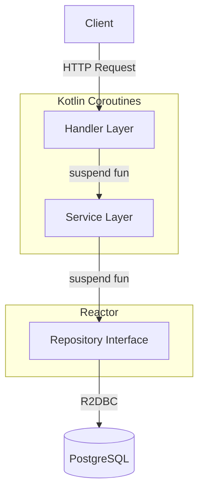

# Website Backend - 开发文档

> 用户网站后端 - Kotlin + Spring WebFlux + R2DBC + Coroutines

## 📋 目录

- [🤖 AI/Vibecode Context](#-aivibecode-context) ⭐ **AI必读优先**
- [📦 项目概述](#-项目概述)
- [🛠️ 技术栈](#️-技术栈)
- [⚡ 快速开始](#-快速开始)
- [🏗️ 架构设计](#️-架构设计)
- [📁 目录结构](#-目录结构)  
- [📝 开发规范](#-开发规范)
- [❓ 常见问题](#-常见问题)
- [📚 相关文档](#-相关文档)

---

## 🤖 AI/Vibecode Context

> **For AI Agents & Vibecode**: 阅读此部分以准确理解上下文和生成规则

### 核心上下文
1. **架构风格**: **Reactive Programming** (响应式编程)
   - **必须**: 所有I/O操作使用 `suspend` 函数
   - **禁止**: 阻塞调用 (`block()`, `blockFirst()`, `blockLast()`)
   - **模式**: Handler → Service → Repository (Kotlin Coroutines)

2. **配置源**:
   - **主要配置**: `src/main/resources/application.yaml`
   - **端口**: `8080`
   - **依赖管理**: `../../gradle/libs.versions.toml` (Version Catalog)

3. **关键文件位置**:
   - Entity: `src/main/kotlin/com/night/website/domain/{module}/entity/`
   - Repository: `src/main/kotlin/com/night/website/domain/{module}/repository/`
   - Service: `src/main/kotlin/com/night/website/domain/{module}/service/`
   - Handler: `src/main/kotlin/com/night/website/interfaces/handler/`

### 代码生成规则
- **✅ 必须**: 所有数据库操作方法使用 `suspend` 关键字
- **✅ 必须**: Repository继承 `ReactiveCrudRepository`
- **✅ 必须**: 使用 `.awaitSingle()`, `.awaitSingleOrNull()` 转换Reactor类型
- **❌ 禁止**: 使用 `block()` 等阻塞调用
- **❌ 禁止**: 在suspend函数中混用Reactor和Coroutines操作
- **依赖引用**: 使用 Kotlin DSL, 通过 `libs.xxxx` 引用

### 决策树

```
需要添加新API端点？
├─ 1. 创建Entity (domain/{module}/entity/)
│    → data class + @Table + @Id
│
├─ 2. 创建Repository (domain/{module}/repository/)
│    → interface extends ReactiveCrudRepository
│
├─ 3. 创建Service (domain/{module}/service/)
│    → suspend fun + .awaitSingle()
│
├─ 4. 创建Handler (interfaces/handler/)
│    → suspend fun + ServerResponse
│
└─ 5. 注册路由 (interfaces/RouterConfig.kt)
     → coRouter { ... }
```

### API路径示例

**完整路径**:
- 新闻列表: `GET http://localhost:8080/news`
- 新闻详情: `GET http://localhost:8080/news/{id}`
- 创建新闻: `POST http://localhost:8080/news`
- 论坛列表: `GET http://localhost:8080/forum`

> 注意：Website模块不使用统一前缀，路径直接以资源名开始

### 代码模板

详见下方 [📝 开发规范](#-开发规范) 章节

---

## 📦 项目概述

Website Backend 是面向用户的新闻和论坛网站的后端API服务。

**核心特性**:
- ✅ 完全异步非阻塞 (Reactive)
- ✅ Kotlin Coroutines 支持
- ✅ R2DBC 响应式数据库访问
- ✅ Modular Domain 架构（按功能模块划分）
- ✅ 高性能低延迟

**端口**: `8080`

---

## 🛠️ 技术栈

| 组件 | 版本 | 说明 |
|------|------|------|
| **Kotlin** | 2.2.21 | 主要开发语言 |
| **Spring WebFlux** | 6.x | 响应式Web框架 |
| **R2DBC** | 1.0.x | 响应式数据库驱动 |
| **Coroutines** | 1.8.0 | Kotlin协程 |
| **PostgreSQL** | 16+ | 数据库（通过R2DBC连接） |
| **Redis** | 7+ | 缓存 (Reactive) |

---

## ⚡ 快速开始

### 1. 环境准备
- **Java 21**
- **Docker** (用于PostgreSQL和Redis)

### 2. 启动项目

```bash
# 1. 确保在项目根目录 (webapp/)
# 2. 运行启动命令（会自动启动PostgreSQL和Redis）
./gradlew :website:bootRun
```

### 3. 验证服务

**测试API**:
```bash
# 获取新闻列表
curl http://localhost:8080/news

# 获取论坛列表
curl http://localhost:8080/forum
```

**预期响应**:
```json
[
  {
    "id": 1,
    "title": "...",
    "content": "...",
    "createdAt": "2024-01-01T12:00:00Z"
  }
]
```

---

## 🏗️ 架构设计

### Reactive 编程模型



### 核心原则
1. **Handler层**: 处理HTTP请求，返回 `ServerResponse`
2. **Service层**: 业务逻辑，使用 `suspend` 函数
3. **Repository层**: 数据访问，返回 Reactor 类型（`Mono`/`Flux`）
4. **转换规则**: 使用 `.awaitSingle()` / `.asFlow()` 将Reactor转为Coroutines

---

## 📁 目录结构

```
website/
└── src/main/
    ├── resources/
    │   └── application.yaml  # 配置文件
    └── kotlin/com/night/website/
        ├── interfaces/       # 接口层
        │   ├── handler/      # Handler处理器
        │   │   ├── NewsHandler.kt
        │   │   └── ForumHandler.kt
        │   └── RouterConfig.kt  # 路由配置
        │
        └── domain/           # 领域层（按模块）
            ├── news/
            │   ├── entity/News.kt
            │   ├── repository/NewsRepository.kt
            │   └── service/NewsService.kt
            │
            └── forum/
                ├── entity/Forum.kt
                ├── repository/ForumRepository.kt
                └── service/ForumService.kt
```

---

## 📝 开发规范

### ✅ 必须遵守

#### 1. Entity定义（R2DBC）

```kotlin
@Table("news")
data class News(
    @Id
    val id: Long? = null,
    val title: String,
    val content: String,
    val authorId: Long,
    
    @CreatedDate
    val createdAt: LocalDateTime? = null,
    
    @LastModifiedDate
    val updatedAt: LocalDateTime? = null
)
```

#### 2. Repository接口

```kotlin
@Repository
interface NewsRepository : ReactiveCrudRepository<News, Long> {
    fun findByAuthorId(authorId: Long): Flux<News>
}
```

#### 3. Service实现 (suspend函数)

```kotlin
@Service
class NewsService(
    private val newsRepository: NewsRepository
) {
    // ✅ 正确：使用suspend + awaitSingle
    suspend fun getById(id: Long): News? =
        newsRepository.findById(id).awaitSingleOrNull()
    
    // ✅ 正确：使用suspend + asFlow + toList
    suspend fun getAll(): List<News> =
        newsRepository.findAll().asFlow().toList()
    
    // ✅ 正确：创建操作
    suspend fun create(news: News): News =
        newsRepository.save(news).awaitSingle()
}
```

#### 4. Handler实现

```kotlin
@Component
class NewsHandler(
    private val newsService: NewsService
) {
    suspend fun getAll(request: ServerRequest): ServerResponse {
        val newsList = newsService.getAll()
        return ServerResponse.ok()
            .contentType(MediaType.APPLICATION_JSON)
            .bodyValueAndAwait(newsList)
    }
    
    suspend fun getById(request: ServerRequest): ServerResponse {
        val id = request.pathVariable("id").toLongOrNull()
            ?: return ServerResponse.badRequest().buildAndAwait()
        
        val news = newsService.getById(id)
            ?: return ServerResponse.notFound().buildAndAwait()
        
        return ServerResponse.ok().bodyValueAndAwait(news)
    }
}
```

#### 5. 路由配置

```kotlin
@Configuration
class RouterConfig(
    private val newsHandler: NewsHandler,
    private val forumHandler: ForumHandler
) {
    @Bean
    fun apiRouter() = coRouter {
        accept(MediaType.APPLICATION_JSON).nest {
            "/news".nest {
                GET("", newsHandler::getAll)
                GET("/{id}", newsHandler::getById)
                POST("", newsHandler::create)
            }
            "/forum".nest {
                GET("", forumHandler::getAll)
                GET("/{id}", forumHandler::getById)
            }
        }
    }
}
```

### ❌ 严格禁止

```kotlin
// ❌ 禁止：使用阻塞调用
suspend fun getNews(): News {
    return newsRepository.findById(1).block()  // 禁止！
}

// ❌ 禁止：在suspend函数中使用Flux.map
suspend fun getAll(): List<News> {
    return newsRepository.findAll()
        .map { it.copy(...) }  // 禁止！Flux.map不能用suspend
        .collectList()
        .awaitSingle()
}

// ✅ 正确：使用asFlow
suspend fun getAll(): List<News> {
    return newsRepository.findAll()
        .asFlow()
        .map { it.copy(...) }  // ✅ Flow.map可以用suspend
        .toList()
}
```

---

## ❓ 常见问题

### Q1: 如何添加新的API模块？

参考上方决策树，按照Entity → Repository → Service → Handler → Router的顺序创建。

### Q2: Reactor和Coroutines如何转换？

```kotlin
// Mono → suspend
repository.findById(id).await SingleOrNull()

// Flux → suspend List
repository.findAll().asFlow().toList()

// Flux → Flow
repository.findAll().asFlow()
```

### Q3: 如何处理分页？

R2DBC暂不支持Spring Data的Pageable，需手动实现：
```kotlin
suspend fun findPage(page: Int, size: Int): List<News> =
    newsRepository.findAll()
        .asFlow()
        .drop(page * size)
        .take(size)
        .toList()
```

---

## 📚 相关文档

- **前端开发**: [website/frontend/README.md](./frontend/README.md)
- **前端工作流**: [website/frontend/WORKFLOW_CN.md](./frontend/WORKFLOW_CN.md)
- **快速上手**: [QUICKSTART.md](../QUICKSTART.md)
- **项目总览**: [README.md](../README.md)

---

**Reactive is the Future!** ⚡
